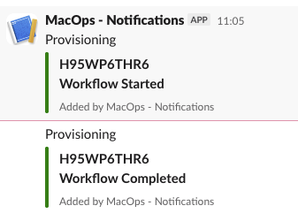

# Jamf Pro Slack Notifications

Send a formatted Slack notification from a Jamf Pro policy by using a Slack
incoming webhook.

The notification includes a title, two free-text message lines, and a
colored status bar. Message line 1 can auto-insert the Mac's serial number.

## Requirements

- Jamf Pro policy execution
- A Slack app with an incoming webhook
- macOS 15 Sequoia, macOS 26 Tahoe, or macOS 27 Golden Gate
- Apple-provided `/bin/bash`, `/usr/bin/curl`, `/usr/sbin/ioreg`, and
  `/usr/bin/awk`
- No third-party dependencies

The script runs unattended as the Jamf Pro policy account and does not require
a logged-in user or GUI session. Compatibility with the listed macOS releases
is a development target and has not been validated on every release.

## Slack setup

Follow Slack's [incoming webhook guide](https://docs.slack.dev/messaging/sending-messages-using-incoming-webhooks)
to create a Slack app, enable incoming webhooks, and select the destination
channel.

An app-based incoming webhook posts to the channel selected during setup. The
script cannot override that channel, the Slack app name, or the Slack app icon.

## Jamf Pro configuration

Upload `jamf-pro-slack-notification.sh` to Jamf Pro and configure these custom
script parameters:

| Parameter | Jamf parameter label | Script variable | Default | Description |
| --- | --- | --- | --- | --- |
| 4 | Slack Title | `SLACK_TITLE_TEXT` | `Provisioning` | Top-level notification title |
| 5 | Message Line 1 | `SLACK_MESSAGE_LINE_1_TEXT` | `SERIALNUMBER` | Free text for the first message line. Type `SERIALNUMBER` (all caps) to auto-insert the Mac's actual serial number instead of typing it manually |
| 6 | Slack Color | `SLACK_COLOR` | `#008000` | A `#RRGGBB` hex value |
| 7 | Message Line 2 | `SLACK_MESSAGE_LINE_2_TEXT` | `Workflow Started` | Free text for the second message line |
| 8 | Slack Webhook URL | `SLACK_WEBHOOK_URL` | None | Slack or GovSlack incoming webhook URL |

Jamf Pro reserves parameters 1 through 3. An empty parameter uses its hard-coded
default. Parameter 8 overrides `HARDCODED_SLACK_WEBHOOK_URL` when both are set.

Both message lines are plain free text — the script no longer prefixes them
with a label like "Serial Number:" or "Status:". If parameter 5 contains the
word `SERIALNUMBER` anywhere, the script replaces the **entire** parameter 5
value with the Mac's actual serial number — it does not substitute just that
word within a longer string. Don't combine `SERIALNUMBER` with a custom label
in the same parameter (e.g. `Serial Number: SERIALNUMBER` will render as only
the serial number, not the label). If you want a label in front of a value,
type the label as its own literal text with no `SERIALNUMBER` in it — the
script won't know the serial number ahead of time to insert into a labeled
string automatically.

### Slack Color values

Parameter 6 sets the vertical bar color next to the message. Set it to a
`#RRGGBB` hex value (e.g. `#008000` for green, `#FFA500` for orange,
`#FF0000` for red) — the script rejects anything else. Use a hex value that
matches your organization's own convention for success, warning, and failure
colors, or your brand color.

### Adding Parameter Labels in Jamf Pro

Jamf Pro's script objects let you label parameters 4 through 11 so that admins
see meaningful field names — instead of "Parameter 4", "Parameter 5", etc. —
when they add this script to a policy. Set these labels once, when the script
is uploaded:

1. In Jamf Pro, go to **Settings** (gear icon) **> Computer Management >
   Scripts**.
2. Click **+ New** to upload `jamf-pro-slack-notification.sh`, or open the
   existing script object if it's already uploaded.
3. On the **General** tab, give the script a display name (e.g.
   `Jamf Pro Slack Notification`) and category.
4. On the **Script** tab, paste or confirm the script contents.
5. On the **Options** tab, enter the following under **Parameter Labels**:
   - Parameter 4: `Slack Title`
   - Parameter 5: `Message Line 1 (type SERIALNUMBER for serial number)`
   - Parameter 6: `Slack Color`
   - Parameter 7: `Message Line 2`
   - Parameter 8: `Slack Webhook URL`
6. Click **Save**.

With labels set, adding the script to a policy's **Scripts** payload shows
these names next to each parameter's input field instead of the generic
parameter number, so the person configuring the policy doesn't need this
README open to know what to type where.

Add the script to a policy, fill in the labeled parameters, scope the policy,
and test it with a non-production Slack channel before production deployment.

## Expected message

Each policy run posts one message per script execution, so a policy that
triggers the script at the start and end of a workflow (e.g. "Workflow
Started" then "Workflow Completed") produces one Slack message per stage:



> **Note:** this screenshot predates the current script and shows "Serial
> Number: …" / "Status: …" labels in front of each value. The script no
> longer adds those labels — message lines now render as plain bold text with
> no prefix, so a message built the same way today would show `C02XXXXXXXXX`
> and `Workflow Started` on their own lines. See the note under the
> [Jamf Pro configuration](#jamf-pro-configuration) table if you want to add a
> label back yourself.

`Provisioning` and both message lines in this screenshot are example values
from one organization's Jamf policy, not fixed text. Every line in the
message comes from a Jamf parameter (or its hard-coded fallback) and reads
differently once your organization sets its own parameter values:

| Message line | Jamf parameter | Script variable | Set in this screenshot to |
| --- | --- | --- | --- |
| Title (top line, e.g. "Provisioning") | 4 — Slack Title | `SLACK_TITLE_TEXT` | `Provisioning` |
| Side bar color | 6 — Slack Color | `SLACK_COLOR` | `#008000` (green — see [Slack Color values](#slack-color-values)) |
| First message line | 5 — Message Line 1 | `SLACK_MESSAGE_LINE_1_TEXT` | `SERIALNUMBER` (resolved to the Mac's actual serial) |
| Second message line | 7 — Message Line 2 | `SLACK_MESSAGE_LINE_2_TEXT` | `Workflow Started` / `Workflow Completed` |
| Destination channel/workspace | 8 — Slack Webhook URL | `SLACK_WEBHOOK_URL` | Not shown in the message body — determines where it posts |
| "Added by …" footer | Not scriptable | — | Set by the Slack app's name during [webhook setup](#slack-setup), the same for every message |

Change the corresponding Jamf parameter to change that line; nothing here is
hard-coded except the fallback defaults listed in the
[Jamf Pro configuration](#jamf-pro-configuration) table, which only apply when
a parameter is left blank.

Both message lines are formatted with Slack `mrkdwn`.

## Webhook security

A Slack webhook URL is a credential. Slack may revoke webhook URLs discovered
in public repositories.

- Prefer supplying the URL at runtime through Jamf parameter 8.
- Restrict access to the Jamf script and policy because Jamf parameters are not
  a dedicated secret-management system.
- Leave `HARDCODED_SLACK_WEBHOOK_URL` empty in files committed to Git.
- Never print or copy the webhook URL into logs, tickets, or documentation.
- If a webhook is exposed, revoke or rotate it in Slack immediately. Removing it
  from the latest file does not remove it from Git history.

For stricter production environments, adapt the script to read the webhook from
an organisation-approved secret-management mechanism instead of either option.
Enable GitHub secret scanning or use a tool such as Gitleaks to detect accidental
credential commits.

## Message format

The message body is built with [Block Kit](https://docs.slack.dev/block-kit/).
The top-level `text` field holds the title. The two message lines are a
`section` block with `mrkdwn` text, nested inside an `attachments` entry
so the entry's `color` field can still render the colored side bar. Slack's
[migration guide](https://docs.slack.dev/messaging/migrating-outmoded-message-compositions-to-blocks/)
confirms `color` is the one legacy attachment field with no Block Kit
equivalent and recommends nesting `blocks` inside the attachment instead of
using the legacy `text`, `fallback`, and `mrkdwn_in` fields — this script
follows that recommendation. Remove the attachment wrapper and move the
section block to the top-level `blocks` array if the colored bar is no longer
required.

Quotes, backslashes, tabs, and line breaks in Jamf parameter values are escaped
before the JSON payload is sent.

## Exit behavior

- Exit `0`: Slack accepted the notification and returned `ok`.
- Exit `1`: configuration or input validation failed, the network request
  failed, or Slack returned an unexpected response.

The request uses a 10-second connection timeout and a 30-second overall timeout.

## Validation

Check Bash syntax before uploading a modified script:

```bash
bash -n jamf-pro-slack-notification.sh
```

Run ShellCheck when available, then test successful and failure paths in a
non-production Jamf policy and Slack channel.
